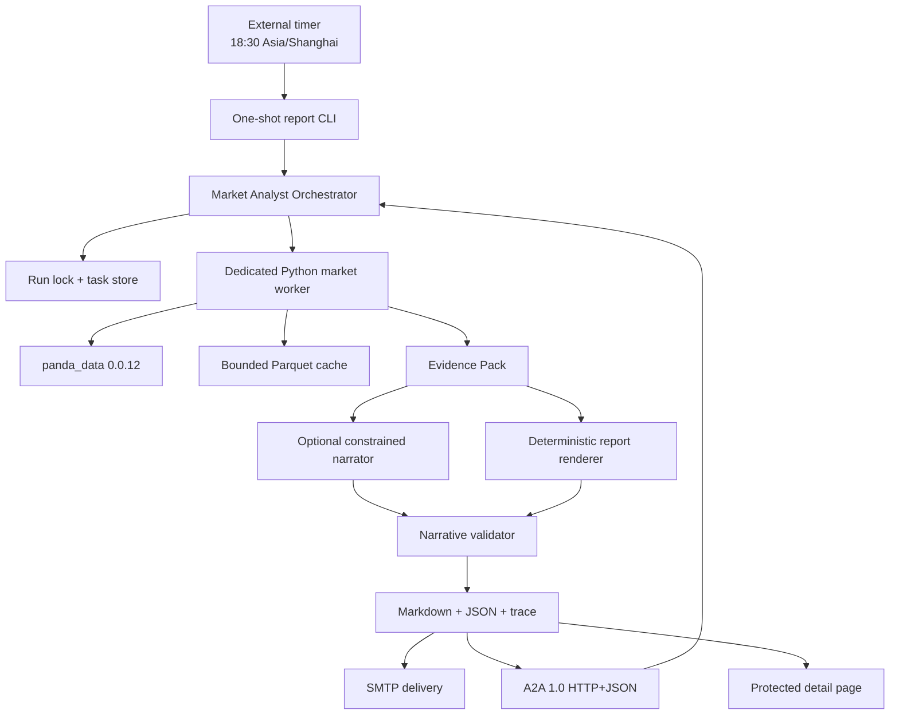

# Panda Market Analyst Agent Design

**Date:** 2026-07-24

**Status:** Approved for implementation planning

**Primary timezone:** `Asia/Shanghai`

**Financial data policy:** `panda_data` is the only financial data source

## 1. Purpose

Build a production-capable market analyst agent that:

1. generates a comprehensive market report after the China market close;
2. identifies market-behavior hot topics, sell-pressure leaders, and a potential research watchlist;
3. sends the report by email at 18:30 Asia/Shanghai on China trading days;
4. exposes the same analytical capabilities through A2A 1.0;
5. records enough evidence, timing, token, tool, and delivery information for a user to trace every conclusion.

The agent is a research and monitoring system. It does not connect to a broker, place orders, rebalance a portfolio, or issue personalized buy/sell instructions.

## 2. Confirmed Product Decisions

- A-shares are the report core.
- The current Hong Kong session, the previous completed US session, Chinese futures, funds/ETFs, options, and macro data provide context when the account has permission and data is available.
- “Hot topic” means a topic inferred from market behavior. The agent must not present it as a news or social-media topic.
- “Top sellers” is implemented as a **sell-pressure watchlist**, not a claim that a known party is selling unless the relevant Panda interface identifies that party.
- “Top potentials” is implemented as a **potential research watchlist**, not a price forecast or recommendation.
- Deterministic code performs all numerical calculations and rankings.
- An optional language model may turn an Evidence Pack into a readable summary. It receives no external data and cannot change computed figures or ranks.
- If the model is unavailable or its output fails validation, a deterministic template produces the report.
- Email is a scheduled delivery channel. It is not represented as A2A Push Notification.

## 3. Authoritative References

The implementation must consult references in this order:

1. The repository copy of `接口文档.md` for exact parameters, response fields, symbol formats, and examples.
2. The exported public surface of pinned package `panda-data==0.0.12`.
3. The current A2A 1.0 specification for discovery, messages, tasks, streaming, headers, media types, and error semantics.
4. Selected PandaAI/QuantSkills assets as design and workflow references:
   - [`skill-pandadata-api`](https://github.com/quantskills/skill-pandadata-api)
   - [`skill-market-daily-review`](https://github.com/quantskills/skill-market-daily-review)
   - [`skill-concept-rotation-monitor`](https://github.com/quantskills/skill-concept-rotation-monitor)
   - [`skill-event-risk-alert`](https://github.com/quantskills/skill-event-risk-alert)
   - [`agent-market-regime-monitor`](https://github.com/quantskills/agent-market-regime-monitor)
   - [`agent-crowding-risk-monitor`](https://github.com/quantskills/agent-crowding-risk-monitor)

The referenced QuantSkills repositories are GPL-3.0. The first implementation will not copy their source. It will implement repository-local Skills and tools from the approved design and the supplied Panda interface contract, while recording upstream attribution in documentation. If the project later vendors GPL files, licensing must be handled explicitly.

## 4. Scope and Non-goals

### 4.1 In scope

- A-share closing review and market breadth.
- Industry and concept/theme rotation.
- Sell-pressure evidence ranking.
- Potential research watchlist.
- Index, Hong Kong, US, futures, fund/ETF, option, and macro context.
- Point-in-time fundamentals, valuation, capital-flow, and event-risk enrichment.
- Markdown, HTML email, JSON Evidence Pack, and JSON Run Trace outputs.
- SMTP delivery with retry, idempotency, and delivery receipts.
- A2A 1.0 HTTP+JSON discovery, task lifecycle, streaming, artifacts, cancellation, and task retrieval.
- Protected detail pages for report and trace inspection.
- Deterministic fallback when no model is configured.

### 4.2 Out of scope

- News, web search, social-media, or third-party market data.
- Intraday alerts in the first version.
- Automatic trading, broker integration, or order generation.
- Personalized portfolio advice.
- Claims that a computed score predicts future returns.
- Arbitrary remote access to any `panda_data` method.
- A2A Push Notification configuration in the first version.
- Multi-node scheduling or distributed job queues.

## 5. Runtime Architecture



### 5.1 Why a dedicated Python worker is required

The existing generic Panda bridge truncates output according to `PANDA_DATA_MAX_ROWS`, which is suitable for a protected query gateway but not for an all-market scan. The market agent therefore uses a purpose-built Python worker that:

- exposes fixed report operations rather than arbitrary SDK methods;
- authenticates once per run;
- batches broad calls;
- performs large DataFrame joins and aggregations in Python;
- emits compact JSON evidence instead of transferring the full market table to Node;
- emits structured per-call trace events with method, timing, row count, coverage, cache status, and response hash.

The generic `src/panda-data.js` gateway remains unchanged for existing platform consumers unless shared security or configuration helpers need a focused extension.

### 5.2 Process boundaries

- Node.js owns A2A, task state, orchestration, optional model calls, report validation, detail HTTP routes, and email delivery.
- Python owns Panda authentication, report-specific data retrieval, point-in-time joins, batch processing, caching, and deterministic metrics.
- The timer calls a one-shot CLI. It does not depend on an in-process `setInterval`.
- The A2A server and CLI use the same orchestrator and acquire the same cross-process run lock.

## 6. Skills and Tools

### 6.1 Agent Skills

The Agent Card and repository-local Skill definitions expose:

| Skill ID | Responsibility |
|---|---|
| `daily-market-report` | Generate the complete closing report and all traceable artifacts. |
| `hot-topic-analysis` | Rank A-share industries and concepts by market-behavior heat and rotation. |
| `sell-pressure-scan` | Rank securities with converging evidence of sell pressure. |
| `potential-watchlist` | Rank research candidates using trend, theme, quality, valuation, capital, liquidity, and risk evidence. |
| `inspect-run-trace` | Retrieve a run summary, tools, calls, timing, token usage, errors, and conclusion lineage. |

Each Skill has one clear output contract. The first four are analytical; `inspect-run-trace` is operational and never performs a new market-data call.

### 6.2 Internal tools

| Tool | Responsibility |
|---|---|
| `panda-market-worker` | Fixed Panda query plans, batching, caching, metrics, and Evidence Pack generation. |
| `report-renderer` | Deterministic Markdown and HTML rendering. |
| `narrative-adapter` | Optional model summary using only the Evidence Pack. |
| `report-validator` | Section, figure, source, freshness, disclaimer, and lineage checks. |
| `smtp-mailer` | STARTTLS delivery, deterministic Message-ID, retry, and receipt recording. |
| `run-store` | Atomic task, artifact, trace, and email-state persistence. |

## 7. Data Acquisition Plan

### 7.1 Trading context

Use:

- `get_last_trade_date`
- `get_trade_cal`
- `get_prev_trade_date`
- `get_trade_list`

The scheduled run proceeds only when the report date is a completed Shanghai trading day. A manual or A2A request may ask for an earlier completed date. Future dates and open sessions are rejected.

### 7.2 A-share core

Use the narrowest documented combination of:

- `get_stock_daily`
- `get_stock_rt_daily` only when the documented session and freshness make it appropriate
- `get_index_daily`
- `get_index_indicator`
- `get_stock_detail`
- `get_stock_industry`
- `get_industry_detail`
- `get_industry_constituents`
- `get_concept_list`
- `get_concept_constituents`

The worker retrieves a broad OHLCV window first, then enriches a bounded candidate set. It must not call every expensive endpoint for every listed security.

Headline breadth excludes suspended and ST securities. Limit-up/down counts compare the close with the documented `limit_up`/`limit_down` fields using a numeric tolerance; one-price limit boards are included in the total and disclosed separately. The report prints these conventions on every run.

### 7.3 Capital and transaction evidence

Use:

- `get_lhb_list`
- `get_lhb_detail`
- `get_margin`
- `get_hsgt_hold`
- `get_block_trade`
- `get_investor_activity`
- `get_holder_count`
- `get_top_holders`

Each dataset carries its actual data date. T+1 or disclosure-lagged data is never labeled as same-day data.

### 7.4 Fundamentals, valuation, and event risk

Use point-in-time available rows from:

- `get_factor`
- `get_fina_reports`
- `get_fina_forecast`
- `get_fina_performance`
- `get_audit_opinion`
- `get_restricted_list`
- `get_stock_pledge`
- `get_stock_pledge_stat`
- `get_stock_shareholder_change`
- `get_stock_status_change`
- `get_repurchase`

Financial rows must be aligned by publication or availability date where the interface supplies it. The implementation must not join a later disclosure into an earlier report.

### 7.5 Cross-market context

When permissions and data are available:

- Hong Kong: daily prices, factors, consensus, insider/shareholder events, and index components.
- United States: previous completed-session prices, factors, consensus, insider/shareholder events, and index constituents.
- Futures: dominant contracts, prices, basis, term structure, positions, warehouse receipts, inventory, and net flow.
- Options: underlying volatility, implied volatility, term structure, and risk indicators.
- Funds/ETFs: fund detail, daily NAV/price, ETF constituents, and creation/redemption data.
- Macro: calendar, releases, and documented macro series.

At 18:30 Asia/Shanghai, the US section uses the most recent completed US trading session and prints that absolute date.

### 7.6 Two-stage query strategy

1. **Broad scan:** trading universe, 20–60 trading days of OHLCV, industry/concept membership, and index context.
2. **Candidate enrichment:** expensive capital, fundamental, valuation, and event interfaces for a bounded preliminary set.
3. **Final evidence:** recompute ranks after enrichment and apply coverage, freshness, and risk rules.

Default bounds:

- no more than 300 preliminary A-share candidates enter enrichment;
- no more than 100 securities receive full slow-interface enrichment;
- final email includes 10 sell-pressure names and 10 potential-watchlist names;
- full machine artifacts may include up to 50 names per leaderboard.

All bounds are configurable and recorded in the trace.

Before executing a plan, the worker verifies that every selected method is exported by `panda-data==0.0.12`. A method described in the interface document but absent from the pinned SDK is marked unavailable and cannot be invoked through a guessed fallback.

## 8. Deterministic Analytical Models

All component inputs are converted to cross-sectional percentile ranks within the relevant universe and date. Higher percentile means more of the named characteristic. Extreme raw values are winsorized at the 2.5th and 97.5th percentiles before aggregation. The Evidence Pack preserves raw values, transformed values, weights, and coverage.

### 8.1 Hot-topic model

Industries and concepts are ranked separately because they are different, overlapping universes.

Eligibility:

- at least 5 constituents;
- at least 80% constituent price coverage for each required window;
- membership snapshot dated on or before the report date.

For each eligible group:

| Component | Weight | Definition |
|---|---:|---|
| 1-day momentum | 25% | Winsorized equal-weight constituent return. |
| 5-day momentum | 20% | Winsorized equal-weight constituent return. |
| Breadth | 20% | Share of covered constituents with positive 5-day return. |
| Turnover heat | 15% | Latest aggregate amount divided by its 20-day median. |
| Acceleration | 15% | Average daily 5-day log return minus average daily 20-day log return. |
| LHB activity | 5% | Covered constituent Dragon-Tiger activity relative to the group universe. |

The report shows:

- top 5 hot industries;
- top 5 hot concepts;
- top accelerating and cooling groups;
- constituent count, coverage, membership date, and overlap warning;
- representative contributors without implying independent concept exposures.

LHB activity is optional. When it is unavailable, its 5% weight is redistributed across the other available components, the original and effective weights are recorded, and confidence is reduced. The remaining five components and their coverage are required for a ranked hot-topic result.

### 8.2 Sell-pressure model

The label is `卖压关注榜`. It does not assert that a specific actor sold unless Panda evidence identifies one.

| Component | Weight | Definition |
|---|---:|---|
| Downside with abnormal volume | 25% | Negative return magnitude combined with amount relative to the 20-day median. |
| LHB net selling | 25% | Net sell evidence from directional Dragon-Tiger rows; cumulative non-directional rows are excluded. |
| Stock Connect reduction | 20% | Recent holding or holding-ratio decline, labeled with its disclosure date. |
| Margin contraction | 15% | Security-level financing balance contraction or documented sell-side margin evidence. |
| Discount/event pressure | 15% | Discounted block trade and documented shareholder-reduction evidence. |

Rules:

- at least 3 independent components must be available;
- missing components cause available weights to be normalized to 100%;
- the original and normalized weights are recorded;
- stale inputs reduce confidence and are never silently treated as zero;
- coverage below the minimum produces `EVIDENCE_INSUFFICIENT`, not a rank.

### 8.3 Potential research watchlist

Universe filters:

- currently tradable;
- not suspended;
- ST and delisting-risk names excluded;
- at least 20 covered trading days;
- median 20-day daily amount of at least CNY 20 million by default;
- point-in-time data availability checks pass.

Base score:

| Component | Weight | Definition |
|---|---:|---|
| Trend and relative strength | 25% | 20-day relative strength plus controlled 5-day acceleration. |
| Industry/concept confirmation | 15% | Membership in broad, accelerating groups rather than a single-name spike. |
| Financial quality and growth | 20% | Documented point-in-time quality, profitability, and growth factors. |
| Valuation reasonableness | 15% | Cross-sectional valuation relative to industry and history when available. |
| Capital confirmation | 15% | Agreement among Stock Connect, LHB institutional rows, margin, block trades, and investor activity. |
| Liquidity and stability | 10% | Tradability, stable coverage, and non-extreme volatility/turnover. |

Risk treatment:

- apply a transparent risk penalty of 0–30 points for crowding, extreme volatility, pledge, unlock, reduction, forecast, and event evidence;
- hard-veto active ST/delisting risk and non-standard audit evidence;
- default hard-veto an unlock above 10% of free float within 30 calendar days when the required denominator is available;
- require at least 70% weighted evidence coverage and at least 4 positive component families.

The output is a ranked research watchlist with score contributions, penalties, veto reasons, confidence, and data freshness. It must not use “buy,” “target price,” or guaranteed-return language.

### 8.4 Market regime and risk context

The report classifies the A-share environment as:

- `HEAT_EXPANSION`
- `NEUTRAL`
- `RISK_EXPANSION`
- `EVIDENCE_INSUFFICIENT`

Inputs include breadth, index trend, turnover, volatility, margin, Dragon-Tiger activity, and option-underlying volatility when available. Thresholds use trailing percentiles and are versioned. This classification provides context and risk language; it does not change the underlying raw ranks without a separately recorded penalty rule.

## 9. Evidence Pack

Every analytical run produces a versioned `evidence-pack.json` with:

- run and report identifiers;
- report date and per-market data dates;
- universe and eligibility counts;
- query coverage and missing-data records;
- metric definitions and version;
- raw, transformed, percentile, weighted, and final values;
- leaderboard ranks and confidence;
- risk penalties and vetoes;
- source method IDs and trace-call IDs;
- human-readable conclusion objects.

Each conclusion has a stable `conclusion_id` and references:

- formula/version;
- metric IDs;
- evidence IDs;
- Panda method calls;
- data windows and dates;
- missing or stale inputs;
- confidence and limitations.

## 10. Report Contract

The email and Markdown report contain:

1. report date, data cutoff, run status, and completeness;
2. executive market-state summary;
3. A-share indices, valuation, breadth, turnover, and limit-move counts;
4. hot industries and concepts;
5. sell-pressure watchlist;
6. potential research watchlist;
7. capital and notable-transaction evidence;
8. Hong Kong, previous-session US, futures, fund/ETF, options, and macro context;
9. event and crowding risks;
10. data freshness, missing interfaces, coverage, and calculation conventions;
11. trace summary and protected detail link when a public base URL is configured;
12. research-only disclaimer.

HTML content is escaped before rendering. Panda text fields and model output are treated as untrusted content.

## 11. Optional Narrative Model

The model receives only a compact Evidence Pack and a strict instruction to:

- use supplied facts;
- preserve all numbers and ranks;
- distinguish facts, derived metrics, and interpretation;
- avoid new entities, events, prices, reasons, or causal claims;
- use absolute dates;
- avoid recommendations.

The response is validated against the Evidence Pack. Unknown numbers, unsupported symbols, rank changes, or missing required sections reject the narrative and trigger deterministic fallback.

Usage recording:

- provider and model;
- request and response time;
- input, output, reasoning, cached, and total tokens when reported;
- seed and temperature when supported;
- finish reason and response fingerprint;
- exact cost only when a versioned pricing table is configured.

If the provider omits usage or pricing is unknown, the field is `null` with a reason. The system must not invent token counts or costs.

## 12. A2A 1.0 Contract

### 12.1 Discovery and interface

- Agent Card: `GET /.well-known/agent-card.json`
- Preferred interface:
  - `url`: `<origin>/a2a/v1`
  - `protocolBinding`: `HTTP+JSON`
  - `protocolVersion`: `1.0`
- Required media type: `application/a2a+json`
- Required request version header: `A2A-Version: 1.0`
- `capabilities.streaming = true`
- `capabilities.pushNotifications = false`

The base URL contains the owner-selected `/a2a/v1` prefix. A2A 1.0 operation paths are appended without an additional protocol-defined `/v1` prefix.

The Agent Card includes non-empty `name`, `description`, and `version`; `supportedInterfaces`; `capabilities`; default input/output modes; the five declared Skills with IDs, names, descriptions, tags, and examples; and the configured security declaration. Default input modes are `text/plain` and `application/json`. Default output modes are `text/markdown` and `application/json`.

### 12.2 Operations

- `POST /a2a/v1/message:send`
- `POST /a2a/v1/message:stream`
- `GET /a2a/v1/tasks/{id}`
- `GET /a2a/v1/tasks`
- `POST /a2a/v1/tasks/{id}:cancel`
- `POST /a2a/v1/tasks/{id}:subscribe`

The server implements A2A error mapping, task visibility, ordered SSE events, cancellation, timestamps, and terminal-state closure.

### 12.3 Task behavior

Long analytical operations return a server-generated Task:

`TASK_STATE_SUBMITTED` → `TASK_STATE_WORKING` → terminal state.

Supported terminal states are completed, failed, canceled, and rejected. Invalid or unsupported inputs are rejected with a structured A2A error or rejected Task according to when validation occurs.

`messageId` is used for duplicate detection within the authenticated caller. A repeated valid request returns the same task/result rather than starting duplicate work.

### 12.4 Inputs

The agent accepts:

- natural-language text matching a declared Skill; or
- a structured data part with:
  - `operation`
  - optional completed `date`
  - optional supported `sections`
  - optional bounded `topN`

The A2A interface never accepts arbitrary SDK method names, credentials, SMTP settings, file paths, or email recipients. A2A-triggered runs generate artifacts and do not send email.

### 12.5 Artifacts

Completed report tasks contain:

- `market-report.md` as text/Markdown;
- `evidence-pack.json` as structured JSON;
- `run-trace.json` as structured JSON.

At least one text artifact is always present so the repository’s existing evaluation client can extract an answer. Large details may be represented by a protected artifact URL plus a compact structured summary.

### 12.6 Authentication

When `MARKET_AGENT_ACCESS_TOKEN` is configured:

- task and detail endpoints require Bearer authentication;
- the Agent Card declares the security scheme;
- task list/get/cancel/subscribe only expose tasks visible to that caller;
- health and well-known Agent Card routes remain public and contain no secrets.

Production configuration requires the access token. An explicit local-development flag may allow loopback-only unauthenticated use.

## 13. Email Delivery

### 13.1 Schedule

- Default: China trading days at `18:30 Asia/Shanghai`.
- The external timer may run Monday–Friday, but the CLI checks `get_trade_cal` and exits successfully without an email on exchange holidays.
- The one-shot CLI supports a completed historical date for recovery.
- Deployment documents include systemd timer and Windows Task Scheduler examples.

### 13.2 SMTP

Use an SMTP client with:

- STARTTLS or implicit TLS according to configuration;
- certificate verification enabled by default;
- connection and send timeouts;
- authentication from environment variables;
- multiple recipients parsed and validated from configuration;
- HTML and plain-text alternatives.

### 13.3 Idempotency and retry

The delivery key is:

`report_date + recipient_hash + report_version`

Rules:

- deterministic RFC-compliant Message-ID;
- maximum 3 attempts with exponential backoff and jitter;
- report success plus email failure retries only email delivery;
- a confirmed delivery is not sent again unless `--force-delivery` is explicitly used;
- concurrent CLI/A2A work is serialized by the report-date run lock;
- SMTP response, provider message ID when supplied, duration, and attempt count are stored.

### 13.4 Delivery outcomes

- `COMPLETE`: all core and requested optional sections passed validation.
- `DEGRADED`: optional sources are missing; email subject includes `[数据降级]`.
- `FAILED`: a core source or invariant failed; no market conclusions are emailed.

When `MARKET_REPORT_SEND_FAILURE_ALERTS=true`, a failed scheduled run makes a best-effort attempt to send a short operational alert containing run ID, failed stage, and a trace link, but no market conclusions. If SMTP itself is the failed dependency, the undelivered alert remains visible in run state and the protected detail view.

## 14. Persistence and Retention

Default layout:

```text
data/market-analyst/
├── state.json
├── locks/
├── cache/
└── runs/
    └── YYYYMMDD/
        └── <run-id>/
            ├── market-report.md
            ├── market-report.html
            ├── evidence-pack.json
            └── run-trace.json
```

State writes are atomic. The lock uses atomic creation, includes process/run metadata, and supports bounded stale-lock recovery.

Default retention:

- compact reports, Evidence Packs, and Run Traces: 365 days;
- raw/intermediate Parquet cache: 30 days;
- failed temporary files: 7 days.

Retention is configurable. Cleanup never removes the latest successful run for a report date.

## 15. Run Trace and Detail View

### 15.1 Run summary

Record:

- `run_id`, `task_id`, trigger type, report date, timezone;
- application version, metric version, Skill versions, and optional upstream reference revisions;
- status, degradation, start/end time, total duration;
- configuration fingerprint excluding secrets;
- artifact paths and hashes;
- email state and receipt summary.

### 15.2 Skill and tool calls

For each call:

- sequence number and parent step;
- Skill ID/version;
- tool name/version;
- Panda method where applicable;
- redacted parameter summary and parameter hash;
- start/end timestamps and duration;
- row count, field list, truncation, coverage, and data-as-of date;
- cache hit/miss and cache key;
- retry count;
- response SHA-256;
- status and sanitized error.

### 15.3 Model calls

Record the usage fields defined in Section 11 and the pricing-table version used for cost calculation.

### 15.4 Conclusion lineage

The detail view lets a user follow:

`conclusion_id → score/formula → metric/evidence IDs → Panda calls → data date/window`

### 15.5 Detail routes

Protected non-A2A operational routes:

- `GET /runs/{runId}`: human-readable trace and report detail;
- `GET /runs/{runId}/report`;
- `GET /runs/{runId}/evidence`;
- `GET /runs/{runId}/trace`.

The email includes the first route only when `MARKET_AGENT_PUBLIC_BASE_URL` is configured.

### 15.6 Secret and privacy rules

Never store or display:

- Panda username, password, or JWT;
- SMTP username/password;
- Authorization headers;
- full recipient addresses in traces;
- unbounded raw provider responses.

Recipient identity is stored as a masked value and stable hash. Provider errors are sanitized before persistence.

## 16. Failure and Degradation Policy

### 16.1 Core failures

The following fail the analytical run:

- trading-date resolution failure;
- tradable-universe failure;
- A-share daily price failure;
- detected output truncation that invalidates a market-wide calculation;
- coverage below a model’s required threshold;
- evidence/report invariant failure.

No market report email is sent for a core failure.

### 16.2 Optional failures

Failures in LHB, Stock Connect, margin, block trade, cross-market, option, fund, macro, consensus, or event sections produce a degraded report when the A-share core remains valid.

The report must show:

- failed method;
- queried date/window;
- affected section and score component;
- weight renormalization or section omission;
- resulting confidence.

### 16.3 Model failures

Timeout, malformed response, unsupported claims, or missing usage does not fail the report. The deterministic renderer is used and the trace records the reason.

### 16.4 Email failures

Email failure does not discard analytical artifacts. Delivery remains retryable and is visible in the trace.

## 17. Security Boundaries

- Panda credentials stay in the Python worker environment and never cross into artifacts.
- Only fixed report operations are exposed; external callers cannot select arbitrary SDK methods.
- A2A request bodies use the repository’s size limits and explicit schemas.
- A2A task/detail routes require authorization in production.
- Model input contains only the compact Evidence Pack, not credentials or raw caches.
- The model has no tools and cannot initiate new data calls.
- HTML output escapes Panda text and model text.
- SMTP TLS verification is on by default.
- Logs and errors use centralized redaction.
- No report content can trigger shell commands or file-path selection.

## 18. Configuration Contract

Existing Panda variables remain authoritative:

- `PANDA_DATA_ENABLED`
- `PANDA_DATA_USERNAME`
- `PANDA_DATA_PASSWORD`
- `PANDA_DATA_BASE_URL`
- `PANDA_DATA_PYTHON`
- `PANDA_DATA_TIMEOUT_MS`

New variables:

| Variable | Purpose |
|---|---|
| `MARKET_AGENT_HOST` / `MARKET_AGENT_PORT` | A2A/detail server bind address. |
| `MARKET_AGENT_PUBLIC_BASE_URL` | Absolute protected-detail link placed in email. |
| `MARKET_AGENT_ACCESS_TOKEN` | A2A and detail Bearer token. |
| `MARKET_REPORT_TIMEZONE` | Defaults to `Asia/Shanghai`. |
| `MARKET_REPORT_EMAIL_TO` | Comma-separated recipients. |
| `MARKET_REPORT_EMAIL_FROM` | Sender address. |
| `MARKET_REPORT_SMTP_HOST` / `PORT` | SMTP server. |
| `MARKET_REPORT_SMTP_SECURE` | Implicit TLS selection. |
| `MARKET_REPORT_SMTP_STARTTLS` | STARTTLS policy. |
| `MARKET_REPORT_SMTP_USERNAME` / `PASSWORD` | SMTP authentication. |
| `MARKET_REPORT_SEND_FAILURE_ALERTS` | Send operational failure notices. |
| `MARKET_REPORT_MODEL_ENABLED` | Enable optional narrative model. |
| `MARKET_REPORT_MODEL_PRICING_JSON` | Versioned token price table. |
| `MARKET_REPORT_RETENTION_DAYS` | Compact artifact retention. |
| `MARKET_REPORT_CACHE_DAYS` | Parquet cache retention. |
| `MARKET_REPORT_MIN_LIQUIDITY_CNY` | Default CNY 20 million. |

The `.env.example` documents variables but contains no live values.

## 19. Planned Repository Structure

```text
agents/market-analyst/
├── server.js
├── cli.js
├── config.js
├── orchestrator.js
├── task-store.js
├── run-trace.js
├── report-renderer.js
├── report-validator.js
├── narrative-adapter.js
├── smtp-mailer.js
├── public/
│   ├── run-detail.html
│   ├── run-detail.js
│   └── run-detail.css
├── skills/
│   ├── daily-market-report/
│   ├── hot-topic-analysis/
│   ├── sell-pressure-scan/
│   ├── potential-watchlist/
│   └── inspect-run-trace/
└── tools/
    └── panda_market_worker.py
deploy/
├── market-analyst.service
├── market-report.service
└── market-report.timer
test/
├── market-analyst-a2a.test.js
├── market-analyst-email.test.js
├── market-analyst-orchestrator.test.js
├── market-analyst-report.test.js
├── market-analyst-trace.test.js
└── market-worker/
    └── test_market_worker.py
```

The implementation plan may split files further when a unit has more than one responsibility, but it must preserve the interfaces and boundaries above.

## 20. Testing Strategy

### 20.1 Python unit tests

Use deterministic fixtures to test:

- trading-day selection;
- return, breadth, turnover, and acceleration calculations;
- constituent snapshot alignment and lookahead prevention;
- percentile normalization and winsorization;
- missing-weight normalization;
- coverage thresholds;
- sell-pressure component direction;
- potential score contributions, penalties, and vetoes;
- point-in-time financial joins;
- cache keys and response hashes;
- structured trace events and secret redaction.

### 20.2 Node unit tests

Test:

- configuration validation;
- task state transitions and atomic persistence;
- cross-process lock behavior and stale-lock recovery;
- Evidence Pack schema validation;
- deterministic report rendering;
- model-claim validation and template fallback;
- token and cost recording;
- SMTP Message-ID, retry, timeout, and receipt handling;
- recipient masking;
- report and trace route authorization.

### 20.3 A2A conformance tests

Test:

- Agent Card validity and declared Skill metadata;
- `supportedInterfaces` binding/version;
- `A2A-Version: 1.0`;
- `application/a2a+json`;
- message send and stream;
- get/list/cancel/subscribe;
- ordered SSE events and terminal closure;
- Task timestamps and artifacts;
- messageId deduplication;
- caller task visibility;
- standard error shapes and status codes;
- unsupported version and malformed input;
- at least one text artifact extractable by the repository evaluator.

### 20.4 Integration tests

Use a fake Panda worker and local fake SMTP server to verify:

- complete scheduled run;
- non-trading-day skip;
- optional-source degradation;
- core-source failure and operational alert;
- model failure fallback;
- SMTP transient retry;
- report success plus email-only retry;
- concurrent trigger idempotency;
- persisted artifacts and conclusion lineage.

### 20.5 Live smoke test

A credential-gated command:

- verifies `panda-data==0.0.12`;
- authenticates;
- runs a bounded one-symbol and one-index query;
- runs a bounded market report for the latest completed date;
- validates artifacts;
- optionally sends to an explicitly supplied smoke-test recipient.

The live test is never part of default CI and never prints credentials.

## 21. Acceptance Criteria

Implementation is complete only when:

1. a real Panda-configured run produces valid Markdown, HTML, Evidence Pack, and Run Trace artifacts;
2. a configured SMTP server receives exactly one email for a successful report-date/delivery key;
3. a repeated non-forced run does not duplicate the email;
4. the email shows hot topics, sell pressure, potential watchlist, data dates, confidence, and disclaimers;
5. every displayed conclusion resolves to evidence and Panda call trace entries;
6. trace details show durations, tools, Skills, rows, data dates, retry/cache state, and model token usage when available;
7. no secret appears in artifacts, logs, HTTP responses, or email;
8. the Agent Card is discoverable and validates as A2A 1.0;
9. A2A send, stream, get, list, cancel, and subscribe pass conformance tests;
10. model absence still produces and emails the deterministic report;
11. optional data loss produces a clearly marked degraded report;
12. core data loss produces no market conclusions and sends only an optional operational failure notice;
13. default automated execution is 18:30 Asia/Shanghai and skips China exchange holidays;
14. the full repository test and syntax-check commands pass.
